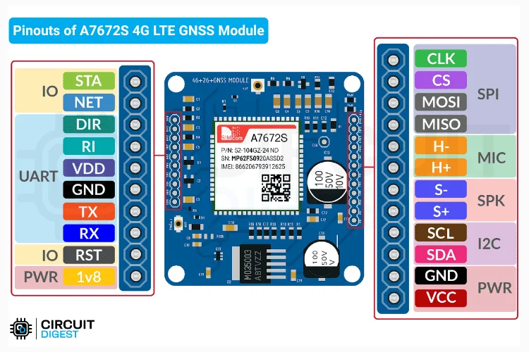
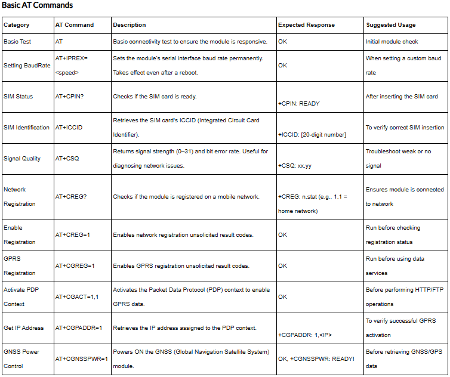
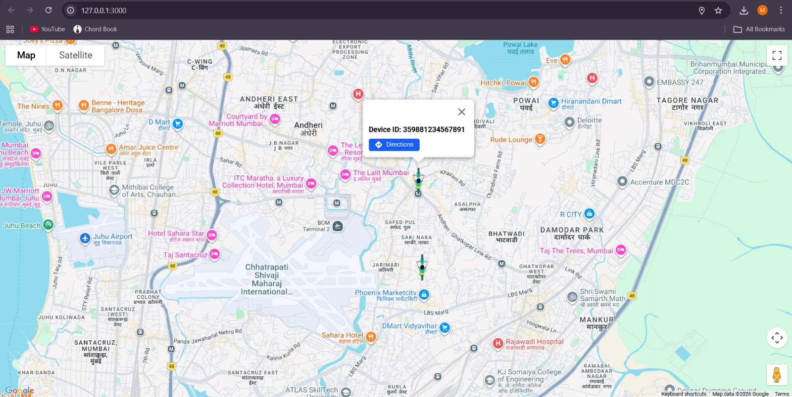

# 🛰️ Cellular IoT GPS Asset Tracker

A complete end-to-end cellular IoT tracking system that acquires live GPS coordinates from a moving asset and transmits them via MQTT over a 4G LTE network to a real-time web dashboard.

## 🛠️ Tech Stack & Hardware
* **Hardware:** ESP32, SIM A7672S (4G LTE + GNSS Development Board)
* **Connectivity:** Airtel 4G SIM, MQTT Protocol (EMQX Broker), AT Commands
* **Cloud & Backend:** Google Cloud (Python VM), Firebase Realtime Database
* **Frontend:** Netlify, JavaScript, Firebase Client SDK, Mapping Library

---

## 📸 Project Visualizations

### 1. Hardware Setup & Pinout
*The A7672S module handles physical location calculation via GPS satellites and establishes the cellular internet connection.*

### 2. Module Communication & Debugging
*Interfacing the ESP32 with the A7672S module using raw AT Commands to establish the LTE connection and handle MQTT publishing.*

### 3. Real-Time Tracking Dashboard
*The live frontend visualization hosted on Netlify, updating seamlessly as Firebase pushes new coordinates via WebSockets.*

---

## 🏗️ System Architecture: The Data Journey

Here is the end-to-end flow of exactly how a coordinate travels from space to the web dashboard:

### 🛰️ Phase 1: Hardware & Data Acquisition (The Asset)
* **The GNSS Antenna:** The antenna on the A7672S module receives signals from GPS satellites orbiting the Earth.
* **The Module (A7672S):** It calculates its exact physical location (Latitude and Longitude) using those signals.
* **The Brain (ESP32):** The ESP32 microcontroller requests this location from the A7672S, taking the raw data and formatting it into a lightweight JSON payload: `{"lat": 19.123, "lng": 72.905}`.

### 📡 Phase 2: Data Transmission (The Network)
* **The Cellular Network:** The A7672S uses an Airtel 4G SIM card to establish an internet connection.
* **The Protocol (MQTT):** For fast, low-power transmission, the ESP32 utilizes MQTT rather than heavy HTTP requests.
* **The Broker (EMQX):** The ESP32 publishes the JSON payload to `broker.emqx.io` on the topic `dim-six/live/gps`. The broker acts as a temporary post office, holding the data for a split second for subscribers.

### 🌉 Phase 3: The Bridge (Google Cloud VM)
* **The Listener:** A Python script (`bridge.py`) running on a Google Cloud Virtual Machine is subscribed to the `dim-six/live/gps` MQTT topic.
* **The Catch:** As soon as the EMQX broker receives data from the hardware, it instantly pushes it to this Python script.
* **The Translation:** The script processes the MQTT message and uses the Firebase Admin SDK to securely open a connection to the database.

### 🗄️ Phase 4: The Database (Firebase)
* **The Storage:** Python overwrites the current coordinate data in the Firebase Realtime Database under the `live_location` node.
* **The Realtime Magic:** Because Firebase uses WebSockets, the moment the data updates, it automatically pushes the new data to any connected web clients.

### 💻 Phase 5: Visualization (Netlify Frontend)
* **The Dashboard:** The frontend application is built using the Firebase Client SDK.
* **The Live Update:** When the site is open, it listens to Firebase. Upon receiving the update trigger from Step 4, it instantly downloads the new payload.
* **The Map:** The JavaScript engine updates the map marker on the UI, reflecting the asset's new physical location in real-time.
